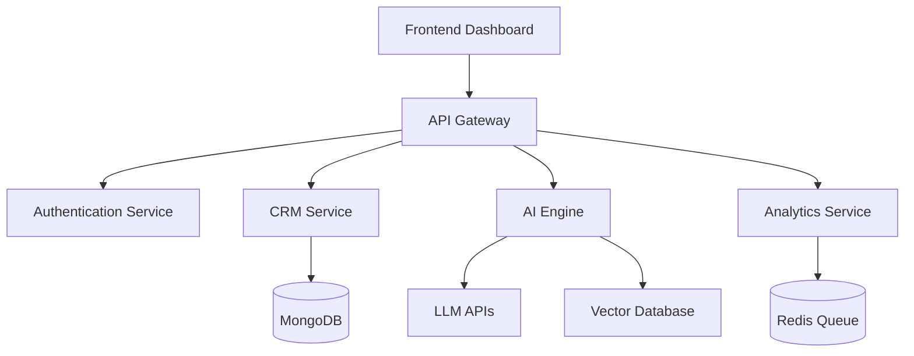

<div align="center">


</div>

<div align="center">

# 🚀 DHRUV // CRM SYSTEM CORE

### AI • Backend • Automation • Microservices • RAG

<br/>

[](https://git.io/typing-svg)

<br/>


</div>

---

# 🧠 CRM Intelligence Dashboard

<div align="center">

<table>
<tr>

<td width="33%">

## 👨‍💻 Developer

```yaml
Name: Dhruv Prajapati
Role: Backend Engineer
Focus: AI + ML + CRM
Experience: MERN + AI Systems
Status: Building
```

</td>

<td width="33%">

## ⚡ Active Stack

```yaml
Backend:
  - Node.js
  - Express
  - FastAPI

AI:
  - LangChain
  - RAG
  - OpenAI
```

</td>

<td width="33%">

## 📡 System Status

```yaml
API Gateway: Online
Redis Queue: Active
AI Engine: Running
Database: Connected
Docker: Healthy
```

</td>

</tr>
</table>

</div>

---

# 📊 Live CRM Metrics

<div align="center">


</div>

---

# 🏗 CRM Architecture



---

# 🤖 AI MODULES

<div align="center">

<table>
<tr>
<td>🧠 RAG Assistant</td>
<td>📈 Lead Prediction</td>
<td>📧 Email AI</td>
</tr>

<tr>
<td>⚡ Workflow Automation</td>
<td>📊 AI Analytics</td>
<td>🔎 Semantic Search</td>
</tr>

<tr>
<td>🎯 Smart CRM</td>
<td>💬 AI Chat System</td>
<td>📝 AI Reports</td>
</tr>

</table>

</div>

---

# ⚙ TECH ECOSYSTEM

<div align="center">


</div>

---

# 📡 SERVICE STATUS

<div align="center">

| Service | Status |
|--|--|
| CRM Core | 🟢 Running |
| AI Engine | 🟢 Active |
| Vector Search | 🟢 Connected |
| Analytics | 🟢 Healthy |
| Notifications | 🟢 Running |
| Automation Engine | 🟢 Online |

</div>

---

# 📈 SYSTEM ACTIVITY

<div align="center">

[](https://github.com/ashutosh00710/github-readme-activity-graph)

</div>

---

# 🏆 ACHIEVEMENTS

<div align="center">


</div>

---

# 🌐 CONNECT NODE

<div align="center">

<a href="https://linkedin.com/in/dhruv-prajapati-b59452242">

</a>

<a href="mailto:dhruvprajapati152@gmail.com">

</a>

<a href="https://github.com/Dhruv-158">

</a>

</div>

---

<div align="center">

# ⚡ SYSTEM MESSAGE

```bash
> Building scalable AI-powered systems for the future.
> Backend first. Automation-driven. Intelligence integrated.
```

<br/>


</div>
