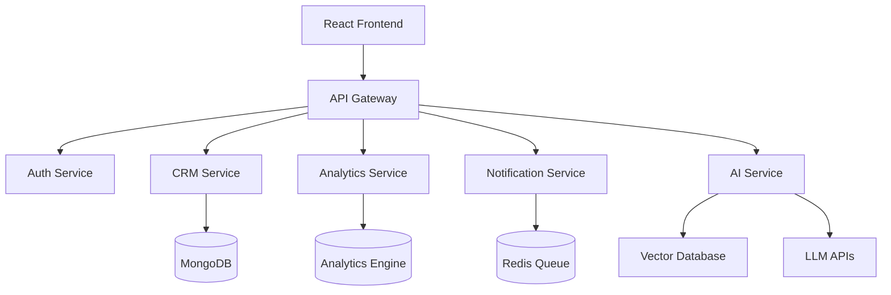

<div align="center">


</div>


<div align="center">

# 🚀 GraphiCRM

### Modern Open Source CRM Platform powered by AI, Automation & Analytics

<br/>

[](https://git.io/typing-svg)

<br/>

<a href="#">

</a>

<a href="#">

</a>

<a href="#">

</a>

<br/><br/>


</div>

---

# 📸 Dashboard Preview

<div align="center">


</div>

---

# ✨ Core Features

<div align="center">

<table>
<tr>

<td width="50%">

## 🤖 AI Lead Scoring

Predict high-converting customers using AI/ML models and behavioral analytics.

</td>

<td width="50%">

## 📊 Analytics Dashboard

Real-time charts, KPIs, sales insights, and business intelligence.

</td>

</tr>

<tr>

<td width="50%">

## 💬 AI CRM Assistant

RAG-powered AI assistant trained on CRM data and workflows.

</td>

<td width="50%">

## ⚡ Workflow Automation

Automate repetitive business processes and notifications.

</td>

</tr>

<tr>

<td width="50%">

## 🔐 Role Based Access

Secure authentication system with advanced permission control.

</td>

<td width="50%">

## 📡 Real-time Notifications

Instant updates using sockets, queues, and event-driven systems.

</td>

</tr>

</table>

</div>

---

# 🧠 AI Modules

<div align="center">

<table>
<tr>
<td>🧠 RAG Chatbot</td>
<td>📧 Email Summarizer</td>
<td>📈 Sales Forecasting</td>
</tr>

<tr>
<td>🤖 AI Ticket Classification</td>
<td>📊 AI Analytics</td>
<td>🎯 Lead Prediction</td>
</tr>

<tr>
<td>📝 Meeting Notes Generator</td>
<td>🔎 Semantic Search</td>
<td>⚡ AI Automation</td>
</tr>

</table>

</div>

---

# 🏗 System Architecture



---

# ⚙ Tech Stack

<div align="center">

## 🚀 Frontend


<br/><br/>

## 🧩 Backend


<br/><br/>

## 🗄 Database & Infrastructure


<br/><br/>

## 🤖 AI / ML


<br/><br/>


</div>

---

# 🚀 Quick Start

```bash
# Clone Repository

git clone https://github.com/yourusername/graphicrm.git

# Move into project

cd graphicrm

# Install dependencies

npm install

# Start development server

npm run dev
```

---

# 🐳 Docker Setup

```bash
docker-compose up --build
```

---

# 📁 Project Structure

```bash
GraphiCRM/
│
├── client/
├── server/
├── ai-engine/
├── notification-service/
├── analytics-service/
├── gateway/
│
├── docker/
├── kubernetes/
├── docs/
└── README.md
```

---

# 🛣 Product Roadmap

- [x] CRM Dashboard
- [x] Authentication & RBAC
- [x] AI Assistant
- [x] Workflow Automation
- [x] Analytics Dashboard
- [x] Notification System
- [ ] Kubernetes Deployment
- [ ] AI Voice Agent
- [ ] Mobile Application
- [ ] Multi-Tenant SaaS Support

---

# 📊 Repository Stats

<div align="center">


</div>

---

# 📈 Contribution Graph

<div align="center">

[](https://github.com/ashutosh00710/github-readme-activity-graph)

</div>

---

# 🏆 GitHub Achievements

<div align="center">


</div>

---

# 🤝 Contributing

Contributions, ideas, and feature requests are welcome!

```bash
Fork → Clone → Create Branch → Commit → Push → Pull Request
```

---

# 🌟 Support The Project

If you like this project:

- ⭐ Star the repository
- 🍴 Fork the repo
- 🧠 Contribute ideas
- 🚀 Build amazing things

---

<div align="center">

## ⚡ "Building intelligent systems for the future."

<br/>


</div>
